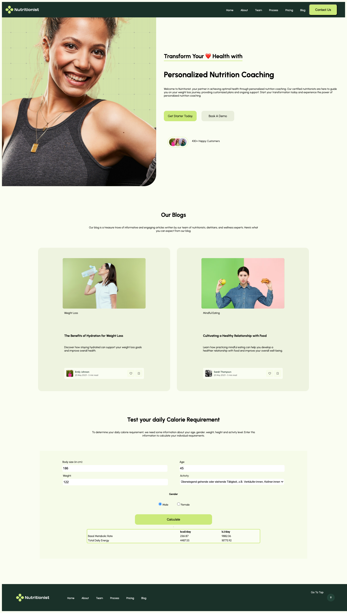

# Health_App

This is a Health App built with React. The app features several components including a blog, a calorie calculator, a hero section, a header, and a footer.

- You can try the Calorie Calculator and switch Dark/Light mode!!

## Project Link

You can view the live project here: [Health App Project](https://health-app-project.netlify.app/)

## Screenshot

## Components

The following components are used in the project:

- **Header**: Displays the navigation bar.
- **Hero**: Displays the main hero section of the app.
- **Blog**: Displays the blog section.
- **CalorieCalculator**: Displays the calorie calculator tool.
- **Footer**: Displays the footer section.

## Installation and Setup

To run this project locally, follow these steps:

1. **Clone the repository:**
   git clone https://github.com/your-username/health-app.git

2. **Navigate to the project directory:**
   cd health-app

3. **Install the dependencies:**
   npm install

4. **Start the development server:**
   npm start

5. **Open the app in your browser:**
   Go to http://localhost:3000 to view the app.
